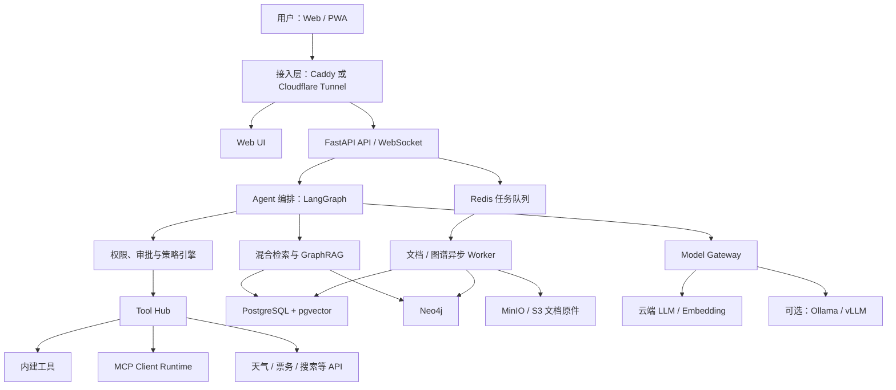
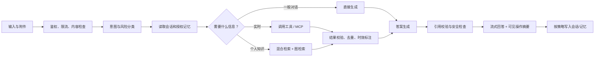

# 个人 AI 助理设计方案

> 版本：v0.1  
> 日期：2026-08-20  
> 状态：方案评审稿

## 1. 项目定位

建设一个面向个人使用、可长期演进的 AI Agent。它以自然语言对话为主要入口，能够调用实时工具、加载 MCP 服务与 Skills、管理个人文档和长期记忆，并通过向量检索与知识图谱回答问题。

产品目标不是做一个“什么都能自主执行”的机器人，而是做一个：

- 回答有依据，实时信息标明来源和查询时间；
- 工具可插拔，模型供应商可替换；
- 涉及账号、写入、支付等动作必须受控；
- 能在一台个人云服务器上以 Docker Compose 稳定运行；
- 数据属于用户，可备份、迁移和删除。

## 2. 范围与边界

### 2.1 首期能力

1. 对话与个性化
   - 流式对话、多轮上下文、会话搜索。
   - 记住用户明确授权保存的偏好，例如出发城市、预算、座位偏好和玩笑风格。
   - 支持文字幽默、段子、小游戏和轻量情绪陪伴；不把它定位为医疗或心理治疗产品。

2. 实时生活工具
   - 天气：实况、逐日/逐小时预报、预警、空气质量。
   - 机票：按日期、城市、舱位、预算查询和比较，返回带时间戳的结果及跳转链接。
   - 火车票：查询车次、时刻、耗时、换乘建议；购票跳转官方或授权平台。
   - 行程：综合交通、天气、兴趣、开放时间和预算生成行程草案。

3. 文档知识库
   - 上传 PDF、DOCX、PPTX、XLSX、Markdown、TXT 和常见图片。
   - 解析、OCR、切片、向量化、关键词索引、版本管理和删除。
   - 回答时展示文档名、页码/段落等引用，不允许凭空编造出处。

4. 知识图谱
   - 从文档、对话中抽取实体、关系和事件，保留来源、置信度和有效时间。
   - 在网页端按节点、关系、来源进行可视化探索。
   - 对话时联合向量、全文和图谱检索，回答中可展示“依据路径”。

5. 扩展系统
   - 内建工具、第三方 API、MCP Server 和 Skill 统一注册、启停和授权。
   - 每个扩展声明权限、输入输出模式、超时、重试和副作用等级。

### 2.2 明确不放入首期

- 自动购买机票、火车票或自动支付。
- 绕过验证码、风控、网站条款或抓取受限票务页面。
- 未经确认发送消息、修改日历、删除文件或执行系统命令。
- 自动将全部私密对话写入长期记忆。
- 用知识图谱替代向量检索；两者是互补关系。

票务“查询”和“下单”必须分离。实时价格和余票应来自官方或具备授权的数据提供商；如果没有合规 API，系统只提供公开信息、搜索辅助和官方页面深链，不模拟登录或持有支付凭证。

## 3. 总体架构



### 3.1 架构原则

- **模块化单体优先**：API、Agent、检索先在一个代码仓库内按模块隔离；CPU 密集的文档处理作为独立 Worker。等真实负载出现后再拆微服务。
- **确定性工作流优先**：天气、票务、文档检索等使用显式节点、结构化输入输出和有限重试，不依赖无限 ReAct 循环。
- **模型与数据源解耦**：Agent 只依赖内部 `ModelGateway`、`Tool`、`Retriever` 接口，不直接绑定某一家模型或票务平台。
- **默认只读**：查询类工具可自动执行；有外部副作用的动作必须审批。
- **来源优先**：事实、关系、票价和天气都携带来源、抓取时间或有效期。

## 4. 推荐技术栈

| 层次 | 推荐方案 | 选择理由 |
|---|---|---|
| 前端 | React + TypeScript + Vite；Tailwind CSS；Cytoscape.js | 对话、管理后台与图谱探索可以在同一 SPA 中完成 |
| 后端 | Python 3.12+、FastAPI、Pydantic、SQLAlchemy/Alembic | 与现有 Python Demo 延续，类型化工具协议和异步 API 成熟 |
| Agent | LangGraph，外包一层自定义领域接口 | 支持持久化检查点、暂停审批、恢复和流式事件；避免业务代码被框架完全绑定 |
| 模型接入 | 自定义 `ModelGateway`，首期支持 OpenAI-compatible API | 可沿用现有兼容接口，也能替换云端或本地模型 |
| 业务数据库 | PostgreSQL | 保存用户、会话、权限、工具、文档元数据和审计日志 |
| 向量检索 | pgvector（HNSW）+ PostgreSQL 全文检索 | 个人规模下减少独立向量库运维，兼顾元数据过滤与事务一致性 |
| 图数据库 | Neo4j Community | 属性图、Cypher 查询、邻域遍历及 GraphRAG 生态完整 |
| 对象存储 | MinIO；也可直连云厂商 S3 | 存储文档原件、解析结果、缩略图和导出文件 |
| 队列与缓存 | Redis + Dramatiq/Celery（二选一，建议 Dramatiq 起步） | 文档 OCR、向量化、实体抽取需要异步、重试和进度反馈 |
| 文档解析 | Docling + Tesseract/RapidOCR | 本地解析布局、表格和扫描文档，原文无需先交给第三方解析服务 |
| 接入 | Caddy；可选 Cloudflare Tunnel + Access | 自动 TLS；单用户部署可叠加身份代理并隐藏源站入口 |
| 可观测性 | 结构化日志 + OpenTelemetry；可选 Prometheus/Grafana | 首期轻量，保留完整调用链和后续扩展能力 |

LangGraph 的检查点可支持故障恢复、人机审批和会话记忆；pgvector 支持精确检索以及 HNSW/IVFFlat 近似索引；Neo4j 官方 GraphRAG 包提供向量、图遍历和知识图谱构建能力。这些能力分别见 [LangGraph Persistence](https://docs.langchain.com/oss/python/langgraph/persistence)、[pgvector](https://github.com/pgvector/pgvector) 和 [Neo4j GraphRAG](https://neo4j.com/docs/neo4j-graphrag-python/current/)。

## 5. Agent 运行设计

### 5.1 单次请求流程



### 5.2 工作流节点

1. `classify_request`：判断闲聊、天气、交通、行程、知识问答、文档操作或设置操作。
2. `load_context`：按 token 预算加载近期对话、用户偏好和相关长期记忆。
3. `plan`：生成结构化计划，只保留内部状态；前端显示简洁“正在查天气”等操作摘要，不暴露模型隐藏思维过程。
4. `authorize`：根据工具权限与副作用级别决定自动执行、弹出确认或拒绝。
5. `execute_tools`：并行执行彼此独立的查询；每个调用设超时、最大返回量和重试策略。
6. `retrieve_knowledge`：对个人知识执行全文、向量和图谱检索。
7. `validate_evidence`：剔除过期、冲突、低置信度或无来源信息。
8. `compose_answer`：生成答案、来源、时间戳、图谱依据路径和可选下一步。
9. `commit_memory`：仅将满足策略的稳定事实写入长期记忆。

### 5.3 记忆分层

- **会话记忆**：当前任务消息、工具结果和检查点，存 PostgreSQL；可按会话删除。
- **语义记忆**：稳定偏好和个人事实，例如“通常从上海出发”，必须附来源和用户确认状态。
- **情景记忆**：过去旅行或重要事件的摘要，不保存无价值的逐字聊天。
- **临时状态**：票价、余票、天气等带 TTL 的实时结果，过期后不能当成当前事实回答。

长期记忆写入采用三种模式：`off`、`ask`、`auto_for_whitelist`。默认使用 `ask`。

## 6. Tool、MCP 与 Skill 设计

### 6.1 统一 Tool 协议

每个工具必须注册以下元数据：

```yaml
name: weather.forecast
version: 1.0.0
description: 查询指定地点和时间段的天气
input_schema: WeatherQuery
output_schema: WeatherResult
permissions: [network.weather.read]
side_effect: none       # none / reversible / irreversible
confirmation: never     # never / policy / always
timeout_seconds: 10
cache_ttl_seconds: 600
data_classification: public
```

工具结果统一包含：`status`、`data`、`source`、`observed_at`、`expires_at`、`warnings`、`trace_id`。模型不得把工具异常字符串当成正常数据继续回答。

### 6.2 MCP Runtime

- 支持本地 `stdio` MCP Server 和远端 HTTP 传输。
- 保存 Server 名称、地址、版本、能力目录、信任等级、启停状态和权限范围。
- 首次连接只获取工具/资源目录；启用高风险工具前需要用户确认。
- OAuth token/API key 加密保存，按请求和权限范围使用；禁止把上游 token 原样透传给另一个服务。
- MCP 返回内容视为“不可信外部输入”，进入 Agent 前做长度限制、类型校验、注入标记和来源标注。
- 工具目录允许缓存，但 Server 能力变化时重新审核新增权限。

MCP 将工具和资源作为标准能力暴露，并要求客户端实现清晰的授权与同意流程；设计以协议的[工具](https://github.com/modelcontextprotocol/modelcontextprotocol/blob/main/docs/specification/2026-07-28/server/tools.mdx)和[授权安全要求](https://modelcontextprotocol.io/specification/2025-06-18/basic/authorization)为基线。

### 6.3 Skill 机制

Skill 是“受版本管理的指令与工作流包”，不是默认拥有主机权限的任意脚本。一个 Skill 包含：

- `skill.yaml`：名称、版本、入口、适用意图、所需工具、模型能力、权限和兼容范围。
- `instructions.md`：模型应遵循的领域流程与输出规范。
- `schemas/`：输入输出 JSON Schema。
- `prompts/`：可复用提示模板。
- `tests/`：至少一个成功案例、一个工具失败案例和一个注入攻击案例。
- 可选 `code/`：只能在隔离 Worker 中运行，使用只读文件系统、CPU/内存/时间限制和网络白名单。

Skill 的安装、升级、回滚和禁用要写入审计日志；依赖的工具未授权时，Skill 显示为“不可用”，不能静默扩大权限。

## 7. 实时生活服务设计

### 7.1 天气

定义统一 `WeatherProvider`，首选适合中国地区的和风天气，也保留 OpenWeather 等适配器。和风天气 API 覆盖城市定位、实况、预报、空气质量、分钟级降水和预警，详见其[开发文档](https://dev.qweather.com/en/docs/api/)。

输出至少包含位置解析结果、温度、体感、降水概率、风、空气质量、预警、数据时间和提供方。行程规划必须使用目标日期的预报而非当前天气。

### 7.2 机票与火车票

实现供应商无关接口：

```text
TransportSearchProvider
├── search_locations(query)
├── search_offers(origin, destination, date, passengers, preferences)
├── get_offer_details(offer_id)
└── build_deep_link(offer_id)
```

数据提供策略分三级：

1. 官方或签约 API：可返回结构化价格和库存，作为生产首选。
2. 聚合搜索 API：结果必须标注供应商、币种、税费范围、查询时间和跳转域名。
3. 无可用 API：返回查询建议和官方页面深链，不把搜索摘要宣称为实时余票。

中国铁路场景优先跳转 12306 完成登录、实名和支付。首期不保存铁路账号、身份证、乘车人或支付信息。机票接口也通过适配器接入，最终供应商应根据账号资质、目标地区、商用条款和数据覆盖在实施前确定，不能把某一演示 API 写死为唯一来源。

### 7.3 行程规划

行程规划采用“约束求解 + LLM 表达”：

- 硬约束：出发/返程时间、预算、营业时间、交通衔接、每日活动上限。
- 软约束：兴趣、节奏、饮食、步行量、天气偏好。
- 外部事实：交通和天气必须来自工具；景点描述可来自检索，但要有来源。
- 结果：逐日表格、交通缓冲时间、费用区间、天气风险、备选方案和待确认项。
- 每次规划保存版本，用户修改约束后生成差异，而不是覆盖旧方案。

## 8. 文档、向量库与知识图谱

### 8.1 文档入库流水线


Docling 可在本地处理常见文档、版面、表格与 OCR，相关能力见 [Docling 安装与 OCR](https://docling-project.github.io/docling/getting_started/installation/)和 [REST API](https://docling-project.github.io/docling/usage/api_server/rest_api/)。

切片策略不采用固定字符数“一刀切”：

- 优先按标题层级、段落、列表和表格边界切分；
- 单块建议约 400–800 tokens，保留 10%–15% 语义重叠；
- 表格以“表名 + 表头 + 行组”形成独立块；
- 每块保存 `document_id`、版本、页码、章节路径、字符范围、哈希和 ACL；
- 文档更新后只重算发生变化的块，旧版本可追溯。

### 8.2 检索流程

1. 查询改写和实体识别。
2. PostgreSQL 全文检索获取关键词候选。
3. pgvector 获取语义候选，并按用户、文档权限和版本过滤。
4. 在 Neo4j 中匹配实体，展开有限跳数的关系与相关来源块。
5. 使用 RRF 或可配置打分融合候选，必要时 rerank。
6. 在上下文预算内去重和多样化选取证据。
7. 生成回答后检查每个关键事实是否能映射到证据。

个人规模初期可先使用精确向量查询；数据量和延迟达到阈值后再建立 HNSW，避免过早牺牲召回率。HNSW 的速度、召回、内存和过滤行为需以自己的语料基准测试。

### 8.3 图谱模型

建议首批节点：

- `Person`、`Organization`、`Place`、`Topic`、`Preference`
- `Trip`、`ItineraryDay`、`TransportSegment`、`Event`
- `Document`、`Chunk`、`Claim`
- `Tool`、`DataSource`

建议关系：

- `MENTIONS`、`ABOUT`、`LOCATED_IN`、`RELATED_TO`
- `PREFERS`、`AVOIDS`、`VISITED`、`PLANS_TO_VISIT`
- `PART_OF`、`DEPARTS_FROM`、`ARRIVES_AT`、`OCCURS_AT`
- `SUPPORTED_BY`、`CONTRADICTS`、`EXTRACTED_FROM`

所有抽取事实至少包含：

```text
source_document_id / source_chunk_id
confidence
extractor_model
created_at
valid_from / valid_to（适用时）
status = proposed | confirmed | rejected
```

对话推断出的个人关系先进入 `proposed`；涉及身份、健康、财务等敏感属性时默认不自动建图。删除文档时，必须级联删除仅由该文档支撑的向量和图谱事实；被多来源支撑的事实只移除相应来源边。

### 8.4 图谱可视化

前端 Graph Explorer 提供：

- 中心实体搜索，按 1–3 跳展开，限制最大节点数；
- 节点类型/来源/时间/置信度过滤；
- 点击节点查看属性、原文片段和来源页；
- 点击关系查看依据及抽取方式；
- 对“合并错误”执行拆分，对错误事实执行拒绝；
- 从一次问答跳转到本次用到的证据子图。

后端只返回经过 ACL 过滤的子图，浏览器不能直连 Neo4j。

## 9. 前端产品结构

1. **对话页**：流式回答、停止生成、重新生成、引用卡片、工具状态、审批卡片和附件上传。
2. **行程页**：行程约束、逐日计划、交通候选、天气风险、预算及版本对比。
3. **知识库页**：上传队列、解析进度、文档版本、切片预览、重建索引和删除。
4. **知识图谱页**：搜索、展开、过滤、溯源、纠错和导出子图。
5. **扩展页**：内建工具、MCP Server、Skill 的安装、权限、测试和日志。
6. **设置页**：模型、Embedding、隐私、记忆策略、数据导入导出和备份状态。

建议使用 PWA，使手机端可添加到主屏；首期不开发独立原生 App。

## 10. API 轮廓

| 方法与路径 | 用途 |
|---|---|
| `POST /api/v1/chat/threads` | 创建会话 |
| `POST /api/v1/chat/threads/{id}/messages` | 发送消息，返回 SSE/WebSocket 流 |
| `POST /api/v1/runs/{id}/approve` | 审批暂停中的工具调用 |
| `POST /api/v1/documents` | 上传文档 |
| `GET /api/v1/documents/{id}/jobs` | 查看解析/索引/建图进度 |
| `DELETE /api/v1/documents/{id}` | 删除原件、块、向量与来源关系 |
| `POST /api/v1/search` | 混合检索调试接口 |
| `GET /api/v1/graph/subgraph` | 获取 ACL 过滤后的子图 |
| `POST /api/v1/graph/claims/{id}/review` | 确认或拒绝图谱事实 |
| `GET/POST /api/v1/integrations/mcp` | 管理 MCP Server |
| `GET/POST /api/v1/skills` | 管理 Skill |
| `GET /api/v1/audit-events` | 查询安全和工具审计记录 |

所有 API 使用版本前缀；异步任务返回 `job_id`；幂等操作接受 `Idempotency-Key`；错误返回稳定的机器码，不将异常栈直接暴露给前端。

## 11. 核心数据模型

PostgreSQL 主要表建议：

- `users`、`auth_identities`、`user_preferences`
- `chat_threads`、`chat_messages`、`agent_runs`、`run_events`
- `tool_definitions`、`tool_permissions`、`tool_invocations`
- `mcp_servers`、`skills`、`integration_credentials`
- `documents`、`document_versions`、`document_chunks`、`document_jobs`
- `chunk_embeddings`、`memory_items`
- `travel_plans`、`travel_plan_versions`、`transport_search_snapshots`
- `approval_requests`、`audit_events`

关键约束：

- 所有用户数据带 `owner_id`，查询层统一注入租户过滤，即使当前只有一个用户也不省略。
- 消息正文、工具原始响应与长期记忆分开保存，允许分别设置保留期。
- 凭证表只保存密文和密钥版本，不允许进入日志、向量库或图谱。
- 实时结果必须有 `observed_at` 与 `expires_at`。

## 12. Docker 部署设计

### 12.1 Compose 服务

```text
assistant-web        前端静态资源
assistant-api        FastAPI、Agent、检索 API
assistant-worker     文档解析、OCR、Embedding、图谱抽取
postgres             PostgreSQL + pgvector
redis                队列、短期缓存、分布式锁
minio                文档与派生文件
neo4j                知识图谱（graph profile）
caddy                 反向代理与 TLS（direct-ingress profile）
cloudflared           可选安全隧道（tunnel-ingress profile）
```

网络划分：

- `edge_net`：只有接入层和 Web/API。
- `app_net`：API、Worker 与内部服务。
- `data_net`：数据库、Redis、MinIO、Neo4j；`internal: true`，不向公网映射端口。

持久卷：`postgres_data`、`minio_data`、`neo4j_data`。Redis 的任务消息可开启 AOF；临时缓存无需长期持久化。镜像使用非 root 用户、固定版本标签、只读根文件系统（需要写入的目录单独挂载）并配置健康检查。

### 12.2 两种接入模式

- **直接接入**：域名指向云服务器，安全组只开放 80/443，由 Caddy 申请 TLS 证书。
- **隧道接入**：`cloudflared` 只建立出站连接，源站无需暴露入站 Web 端口，再用 Access 限制为个人账号。Cloudflare 官方说明其 Tunnel 使用出站连接并支持 Docker 部署，见 [Tunnel 文档](https://developers.cloudflare.com/tunnel/)；若服务器在中国大陆或访问链路有特殊要求，应先实测延迟与可用性，再决定是否采用。

### 12.3 资源建议

| 配置 | 适用场景 |
|---|---|
| 2 vCPU / 4 GB / 40 GB | 轻量版：外部模型、少量文档、不运行 Neo4j 或只按需启动 |
| 4 vCPU / 8 GB / 80 GB | 推荐起点：外部模型、Neo4j、CPU 文档解析和个人知识库 |
| 8 vCPU / 16 GB+ | 较多 OCR、批量建图或多用户试用 |

本地运行生成式大模型不包含在上述预算内；若要本地模型，应根据模型量化大小另配内存/GPU。个人服务器首期建议使用外部 LLM，Embedding 可在云端与本地小模型之间选择。

### 12.4 发布与备份

- CI 构建固定版本镜像并生成 SBOM，部署时执行数据库迁移、健康检查和冒烟测试。
- 更新采用“备份 → 拉取镜像 → migration → 滚动重启 → 健康检查”；失败时回滚应用镜像，数据库迁移必须提供向前修复策略。
- PostgreSQL 每日逻辑备份；Neo4j、MinIO 每日/每周快照；使用 restic 加密上传到另一地域对象存储。
- 默认目标：RPO 24 小时、RTO 2 小时；每月做一次实际恢复演练。
- `.env` 只作为本地开发方式；生产优先 Docker Secrets、SOPS 或云端密钥管理服务。

## 13. 安全与隐私

### 13.1 身份与访问

- 单用户也必须登录；推荐 OIDC/Cloudflare Access，或 Argon2id 密码 + TOTP。
- 会话 Cookie 设置 `HttpOnly`、`Secure`、`SameSite`，高风险设置需要重新认证。
- API、文档、图谱和 WebSocket 均执行所有者 ACL，不依赖“前端不显示”。

### 13.2 工具风险分级

| 等级 | 示例 | 默认策略 |
|---|---|---|
| L0 无副作用 | 天气、公开搜索、知识库查询 | 可自动执行，限流和审计 |
| L1 可逆写入 | 新建行程草稿、保存偏好 | 首次或敏感内容时确认 |
| L2 外部写入 | 发邮件、改日历、提交表单 | 每次展示参数并确认 |
| L3 不可逆/高敏感 | 支付、购票、删除外部数据、系统命令 | 首期禁用；以后使用双重确认和强认证 |

### 13.3 关键防护

- 文档、网页、MCP 输出均可能包含提示注入；外部内容不得修改系统策略、授权状态或工具参数。
- Tool 参数由 Pydantic/JSON Schema 验证；URL 工具防 SSRF，禁止访问云元数据地址、内网网段和非白名单协议。
- 上传内容检查真实 MIME、扩展名、大小、压缩炸弹和宏；解析容器不执行文档内代码。
- MCP/Skill 安装源采用白名单和版本锁定；新增权限必须重新确认。
- 日志默认脱敏，不记录 token、Cookie、身份证、完整票务乘客信息或完整文档正文。
- 提供“一键导出”和“彻底删除”；删除任务必须覆盖原件、派生文件、块、向量、图谱来源及备份保留策略说明。

### 13.4 当前代码的立即风险

现有 Demo 源码中已经出现硬编码 API 密钥。进入任何后续开发前应立刻吊销并轮换该密钥，从代码和历史记录中清理，改为环境变量或 Secret 注入，同时加入 `detect-secrets`/`gitleaks` 类预提交检查。设计阶段不复述或迁移现有密钥。

## 14. 可观测性与质量保障

每次 Agent Run 使用统一 `trace_id`，串联：用户请求、模型调用、检索、工具调用、审批、token/费用和最终引用。

核心指标：

- 首 token 延迟、总响应时间、模型/工具错误率；
- 每类工具成功率、超时率、缓存命中率；
- 文档解析成功率、每页处理时间、索引队列积压；
- 检索 Recall@K、引用覆盖率、无依据回答率；
- 图谱实体合并错误率、低置信度事实比例；
- 单日 token 与第三方 API 费用预算。

测试分层：

1. 单元测试：工具参数、权限策略、切片、融合评分和删除级联。
2. 合同测试：模型供应商、天气/票务 Provider、MCP Server 和对象存储。
3. Agent 场景测试：工具失败、超时、结果冲突、需要审批、无证据拒答。
4. RAG 评测集：自有文档建立问题—答案—证据页的黄金集。
5. 安全测试：提示注入、SSRF、越权、恶意文档、凭证泄漏和 Skill 权限升级。
6. Docker E2E：从空卷启动、迁移、上传、问答、备份和恢复。

## 15. 分阶段实施路线

### 阶段 0：安全基线与工程骨架（1–2 天）

- 轮换泄露的密钥，建立 `.env.example`、Secret 管理、日志脱敏和依赖锁文件。
- 建立 FastAPI、前端、PostgreSQL、Redis 的 Compose 骨架及 CI。
- 定义领域接口：`ModelGateway`、`Tool`、`Retriever`、`TransportProvider`。

**完成标准**：新环境一条 Compose 命令启动；仓库扫描不到有效密钥；健康检查通过。

### 阶段 1：可用的对话与工具 Agent（约 2 周）

- 流式对话、会话持久化、LangGraph 检查点。
- 模型配置、天气工具、公开搜索工具、权限与审计。
- 基础 PWA 和部署入口。

**完成标准**：天气回答包含位置、数据时间和来源；工具失败时可解释且不伪造结果；服务重启后会话可恢复。

### 阶段 2：交通查询与行程（1–2 周）

- 机票/火车 Provider 接口、至少一个合规数据源或官方深链适配器。
- 行程约束、版本、天气风险和预算区间。

**完成标准**：实时结果明确查询时间、提供商和限制；无可靠数据源时明确降级；不触发自动下单。

### 阶段 3：文档知识库与 RAG（约 2 周）

- MinIO、Docling Worker、OCR、切片、pgvector、全文检索和引用。
- 文档版本、进度、删除与重建。

**完成标准**：黄金集引用命中率达约定阈值；答案可跳转到原文页/片段；删除后不能再检索到内容。

### 阶段 4：知识图谱与 GraphRAG（2–3 周）

- Neo4j schema、实体关系抽取、消歧、溯源和人工纠错。
- Graph Explorer 与向量/图谱联合检索。

**完成标准**：每条关系有来源与置信度；问答能返回本次使用的证据子图；纠错会影响后续检索。

### 阶段 5：MCP、Skill 与生产加固（约 2 周）

- MCP 管理、Skill 包、隔离运行和权限审批。
- 限流、成本预算、备份恢复、监控、漏洞扫描和发布回滚。

**完成标准**：能安装、测试、禁用和回滚一个扩展；高风险能力未经确认无法执行；完成一次异机恢复演练。

## 16. MVP 验收清单

- [ ] Docker Compose 在干净的 Linux 服务器上可重复启动。
- [ ] Web 与 API 只有一个受保护的公网入口，数据库不暴露端口。
- [ ] 可切换至少两种 OpenAI-compatible 模型配置，不改 Agent 业务代码。
- [ ] 天气和交通结果有来源、查询时间、有效期和降级提示。
- [ ] 文档上传后可看到解析进度，并能带页码/段落引用问答。
- [ ] 向量检索、全文检索和图检索可分别开关和诊断。
- [ ] 知识图谱节点/关系可追溯到原始片段，可人工纠错。
- [ ] MCP/Skill 能启停、声明权限、限制超时并记录调用审计。
- [ ] 外部写操作必须审批；支付和自动购票默认不存在可执行路径。
- [ ] 数据可导出、删除、备份并恢复。

## 17. 需要在实施前确认的决策

以下选项不会阻碍工程骨架开发，但会影响 Provider 与部署配置：

1. 云服务器所在地、CPU/内存/磁盘，以及是否有 GPU。
2. 主要模型供应商、Embedding 模型和月度费用上限。
3. 票务覆盖范围：仅中国，还是同时需要国际机票/铁路。
4. 是否已有合法可用的票务 API 账号；若没有，首期采用官方深链模式。
5. 单用户还是家庭多用户；后者需要更严格的文档与图谱隔离。
6. 域名和接入方式：直接 HTTPS 或 Cloudflare Tunnel/其他身份代理。
7. 文档敏感等级：是否允许调用云端 Embedding/LLM，还是必须本地处理。

## 18. 最终建议

以“阶段 0 + 阶段 1 + 阶段 3”为第一个真正有价值的版本：先得到安全、可对话、能用工具、能读个人文档且回答有引用的助理。交通查询作为独立 Provider 并行验证数据资质；知识图谱在文档管线稳定后建设。这样可以先解决核心体验，也避免因票务接口或图谱抽取质量拖住整个项目。

