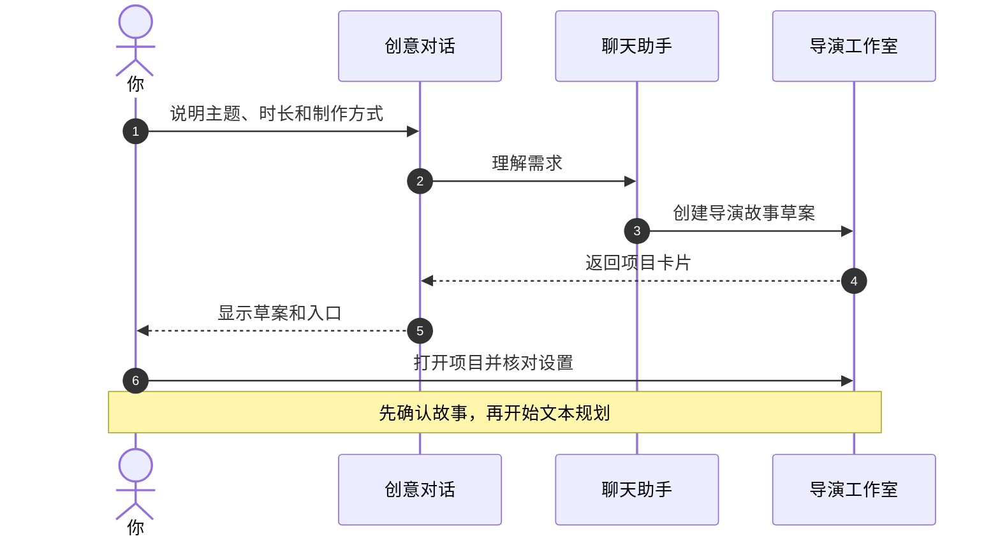
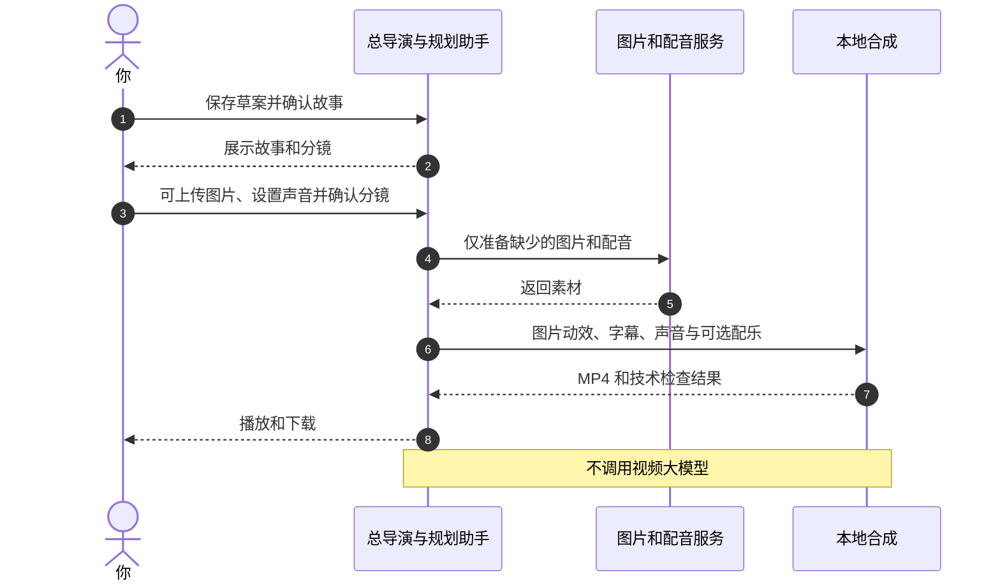
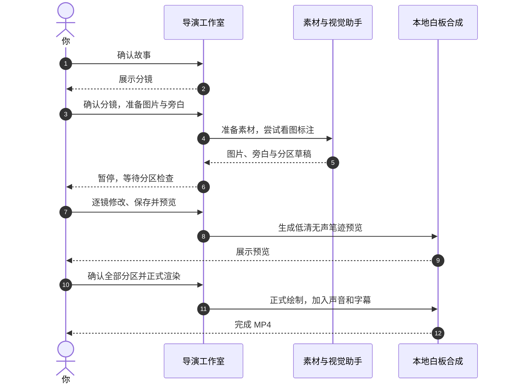
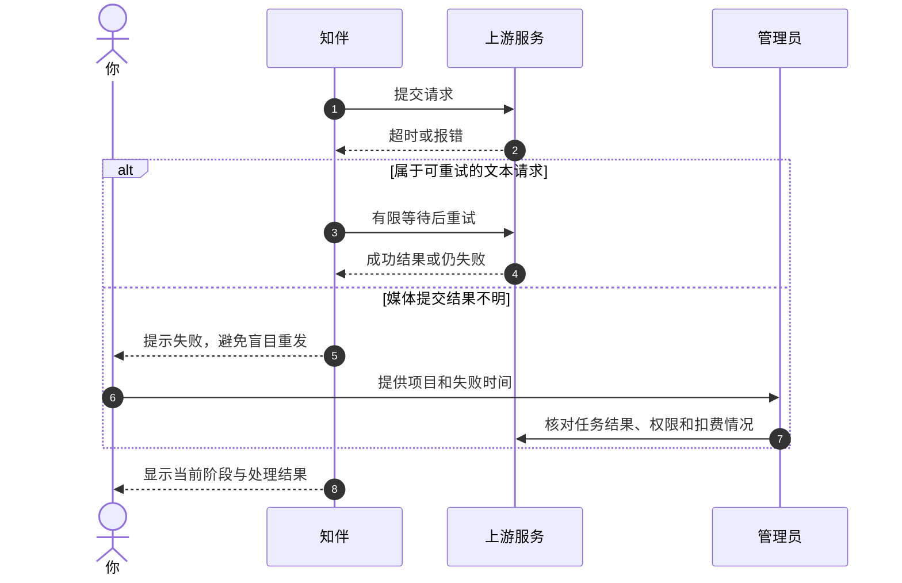

# 知伴 AI 使用说明

## 从第一次打开，到做出第一条作品

适用版本：`e32fc3b`　更新日期：2026 年 9 月 15 日

这份说明写给第一次使用知伴的人。不需要会编程，也不需要先认识“大模型”。

把知伴想成一个制作小组：你说出想法，它帮你整理故事、准备画面、配音和制作视频。**你是决定做什么、是否继续和作品是否合格的人。**

> 给小朋友：请和家长或老师一起使用。点击生成图片、语音、音乐或动态视频，可能花钱。不要上传家庭住址、证件照片、密码或别人的隐私。
>
> 这份说明以实际代码和当前界面为准。页面上的旧“使用指南”仍有偏重动态视频的说明；使用白板或图文动效时，请以本说明对应章节为准。

## 目录

1. [先认识几个词](#words)
2. [第一次打开和登录](#login)
3. [页面上的按钮在哪里](#map)
4. [先用聊天把想法说清楚](#chat)
5. [三种视频制作方式](#modes)
6. [第一次练习：做一条图文动效短片](#first)
7. [白板手绘：怎样让图片按顺序画出来](#whiteboard)
8. [动态视频：需要真实动作时怎么选](#video)
9. [配音、字幕与背景音乐](#sound)
10. [看进度、看 Agent 和看日志](#logs)
11. [下载作品、修改作品和保存偏好](#finish)
12. [出错时怎么办](#help)
13. [哪些操作可能花钱](#cost)
14. [直接复制的指令小抄](#prompts)
15. [给管理员的准备清单](#admin)
16. [功能边界和资料来源](#limits)

<a id="words"></a>
## 1. 先认识几个词

| 页面里的词 | 用简单的话解释 | 例子 |
| --- | --- | --- |
| Agent | 能按步骤做事的小助手 | 写故事的小助手、检查成片的小助手 |
| 大模型 | 负责理解和生成内容的 AI 服务 | 帮你写一段解说词 |
| 渠道 | 系统连接外部服务的入口 | 图片渠道负责生图，语音渠道负责配音 |
| 项目 | 一部作品的文件夹和制作记录 | “小树为什么需要阳光”这个视频项目 |
| 草案 | 还没有开始正式制作的计划 | 一段故事想法和一些设置 |
| 分镜 | 把整部作品分成几小段 | 第一镜讲阳光，第二镜讲水分 |
| 旁白 / 配音 | 视频里讲解内容的声音 | “阳光帮助小树生长。” |
| 字幕 | 画面下面跟着声音出现的文字 | 屏幕上出现同一句讲解词 |
| 画幅 | 画面是竖着还是横着 | 手机竖着看用 9:16，横着展示用 16:9 |
| 渲染 / 合成 | 把图片、声音和字幕做成视频文件 | 最后得到一个 MP4 |
| 门禁 | 暂停检查，满足条件才能往下走 | 等你确认分镜后再生成素材 |
| 连续性圣经 | 角色和画面的统一说明本 | 小兔一直穿蓝衣服，不能下一镜变红 |
| 日志 | 系统做事留下的记录 | “第 1 镜配音完成”“正在本地合成” |
| SRT | 写有字幕内容和出现时间的文本文件 | 第一句在第 0 秒到第 2 秒显示 |

一个常见误会：聊天列表里有某个模型，**不代表它就能画图或生成视频**。聊天、图片、语音和视频使用的渠道可能不同。

同文件夹还提供 [PPT 教学版](知伴AI使用指南-20260915.pptx)，适合边讲边操作。建议先阅读本说明的第 5、6、9 节，再做第一次练习。

<a id="login"></a>
## 2. 第一次打开和登录

### 2.1 打开正确的网址

当前使用入口：[知伴 AI 工作室](https://101.42.90.142:18000/)。如果管理员给了新的域名，请使用管理员提供的地址。

如果浏览器提示证书或连接不安全，先请管理员核实网址和证书。不要在陌生网页填写账号，不要随便跳过安全提示。

### 2.2 已经有账号

1. 点击“登录”。
2. 输入自己的邮箱和密码。
3. 填写页面显示的计算验证码。
4. 点击“进入知伴”。
5. 登录后通常会进入“视频工作室”。

验证码过期或错误时，点击验证码区域刷新，再重新填写。

### 2.3 还没有账号

1. 点击“注册”。
2. 填写邮箱、密码和页面要求的计算验证码。
3. 点击“发送验证码”，去自己的邮箱查收邮件。
4. 把邮件中的 6 位验证码填回网页，完成注册。

密码至少 8 个字符。请使用独立密码，不要把密码发给聊天助手。当前版本每天最多开放 3 个新用户注册；遇到名额限制可稍后再试，或联系管理员。

收不到邮件时，先检查垃圾邮件，再请管理员检查邮件渠道。反复点击发送并不会保证更快收到。

### 2.4 忘记密码或离开电脑

- 忘记密码：点击“忘记密码？”，按邮件中的重置链接操作。
- 使用完公用电脑：点击右上角头像，再点“退出登录”。
- 不要把密码、验证码、密码重置链接写进这份说明或发送给别人。

<a id="map"></a>
## 3. 页面上的按钮在哪里

电脑上主要看左侧和页面上方。手机上可以看底部导航；项目列表可能要点菜单按钮才会展开。

| 入口或按钮 | 什么时候用 |
| --- | --- |
| 创意对话 | 先聊想法、改文案、读附件，也可以从聊天创建导演项目 |
| 新建对话 | 换一个话题，避免和前面的内容混在一起 |
| 视频工作室 | 查看和制作视频项目 |
| 制作台 | 查看当前项目、分镜、确认按钮和制作进度 |
| 作品库 | 找回历史成片、镜头片段和失败记录 |
| 开始制作 | 先做首个约 4 秒镜头，适合试效果 |
| 一键成片 | 按所选目标时长规划并制作整片，仍然需要确认 |
| 新建短剧项目 | 创建一个新项目，随后核对制作方式和时长 |
| 制作设定 / 编辑草案 | 项目未启动时修改设置；已启动后通常改为“以此新建一版” |
| 配音、字幕与配乐 | 制作前选声音、试听、选字幕样式和背景音乐 |
| 创作偏好 | 设置今后常用的风格、受众、节奏等 |
| 创作记忆 | 查看或删除系统保存的长期创作信息 |

**“一键成片”不表示按一次后就永远不用管。**系统仍会请你确认故事和分镜；白板还需要确认分区。

<a id="chat"></a>
## 4. 先用聊天把想法说清楚

### 4.1 最简单的聊天方法

1. 打开“创意对话”。
2. 在输入框上方选择管理员提供的可用模型。看不到模型时可点刷新按钮。
3. 在输入框写清楚要做什么。
4. 点击发送按钮，等待回答。
5. 不满意时，指出具体哪里需要改。

不太清楚的说法：

> 帮我做一个好看的视频。

更清楚的说法：

> 我想给小学生讲“小树为什么需要阳光”。先帮我写一段 30 秒左右的解说词，用简单的话。现在只写文字，不生成图片、语音或视频。

可以按这个顺序写：**讲什么、给谁看、做多长、喜欢什么样子、不要什么、现在做哪一步。**

“不要现在生成”很重要。聊天中的音乐、语音工具可以直接提交任务，并不都像导演分镜一样有第二个确认按钮。

### 4.2 上传资料让它帮忙读

点击输入框旁的“上传附件”，选择资料，等附件出现在附件栏后再发送问题。

当前界面接受 PDF、Word、PPT、Excel、CSV，以及 TXT、Markdown、JSON、HTML 等文件。默认单文件上限约 20 MB，每条消息最多使用 4 个附件，实际以页面和管理员配置为准。

示例：

> 请读这份课程资料，整理成三段解说词。先指出你看不清或不确定的地方，不要直接制作视频。

注意：

- 扫描不清、只有图片的文档不一定能完整识别。先问它“你读到了哪些内容”。
- 上传附件主要用于读取资料，不表示知伴能够生成或编辑所有 Office 文件格式。
- **导演分镜图片上传是另一个入口**，在工作室的分镜区域。不要把它和聊天附件按钮混淆。
- 资料内容可能会发送给已配置的外部模型或文档处理服务。不要上传未获授权的敏感资料。

### 4.3 从聊天创建导演项目

可以复制下面这段：

> 请启动导演工作室，创建一个图文动效项目。主题是“小树为什么需要阳光”，给小学生看，30 秒，16:9 横屏，温暖简笔画风格，带中文旁白和字幕。一键成片。不要调用视频大模型，先保存草案，等我确认。

看到项目卡片后，打开对应项目，检查制作方式是不是“图文动效”。如果要白板，就明确写“白板手绘”。



读图方法：从上往下读。每一列代表一个人或一个助手，箭头表示“把什么交给谁”。图看不出来时，直接看本节的操作步骤即可；Mermaid 时序图需要阅读软件支持。

### 4.4 搜索网页和生成简单文件

管理员启用联网能力时，可以这样问：

> 请搜索关于这个主题的资料，给出网页来源，并告诉我哪些内容还不确定。先不要制作视频。

看回答时留意它是否真的显示搜索步骤和来源链接。没有可靠来源时，不要把回答当成已经核实的事实。搜索能否成功还取决于当前模型、网络和管理员配置。

也可以请它把内容整理成可下载的小文件：

> 请把刚才确认的解说词整理成一个 Markdown 文件，文件名叫“阳光和小树.md”。

当前普通文件工具支持 Markdown、TXT、CSV、JSON、HTML 等文本文件，单个生成文件上限约 1 MB。能读取 PPT 或 Word 附件，不代表知伴当前的普通文件工具就能直接输出真正的 PPTX 或 DOCX。本次随说明提供的 PPT 是单独制作的教学资料。

<a id="modes"></a>
## 5. 三种视频制作方式

| 制作方式 | 看起来像什么 | 谁让画面变化 | 适合什么内容 | 重要提醒 |
| --- | --- | --- | --- | --- |
| 白板手绘 | 一支笔按顺序画线稿，再添颜色 | 服务器本地绘制图片区域 | 知识讲解、故事复述 | 要确认分区；没有真实角色动作 |
| 图文动效 | 一张完整图片缓慢推近、拉远或左右移动 | 服务器本地处理图片 | 图片故事、轻量讲解 | 不用白板分区；不是人物真的在动 |
| 动态视频 | 人物、物体或镜头出现真实的连续运动 | 已配置的视频模型渠道 | 短剧、动作镜头 | 会产生视频模型调用费用，效果仍需检查 |

新项目默认“白板手绘”。想少做一步分区操作时，可以主动选“图文动效”。

### 5.1 三种方式都会花钱吗？

白板和图文动效**没有视频模型调用费**，但文本规划、生图、MiniMax 配音或音乐生成仍可能收费。服务器本地合成也需要计算资源。

上传自己的图片，可以跳过对应分镜的生图请求。选择 Edge 配音不需要语音 API 密钥，但它仍是依赖网络的服务，不能保证每次都可用。

### 5.2 画幅和清晰度怎么选

- 手机竖着看：选 **9:16 竖屏**。
- 电脑、电视或课堂横着展示：选 **16:9 横屏**。
- 第一次试片：先选标准清晰度，确认效果后再考虑更高档位。

白板和图文动效的标准输出为 720×1280 或 1280×720；高清为 1024×1792 或 1792×1024。内部的 `768P`、`2K` 是兼容渠道的档位名称，请以界面显示的实际像素为准。

动态视频的可用分辨率、画幅和时长还受视频渠道限制。不要把“高清”理解为一定会让故事更好。

<a id="first"></a>
## 6. 第一次练习：做一条图文动效短片

这条路线不需要学习白板分区。下面以“先试一镜”为例。

### 第 1 步：打开制作窗口

进入“视频工作室”，点击“开始制作”。

“开始制作”先做首镜预览。即使表单里选了较长目标时长，也不要把首镜预览当成已经制作了整片；完整作品应使用“一键成片”。

### 第 2 步：填入明确的想法

可复制：

> 给小学生讲“小树为什么需要阳光”。用一棵小树和太阳做主角，语言简单，温暖简笔画风格。用中文旁白，画面里不要生成文字，字幕由系统添加。先试一个镜头。

建议设置：

| 字段 | 第一次练习填什么 |
| --- | --- |
| 制作渠道 | 图文动效 |
| 目标时长 | 4 秒试片 |
| 画幅 | 16:9 横屏 |
| 清晰度 | 标准 |
| 视觉风格 | 温暖简笔画、背景简洁 |
| 角色与定妆信息 | 小树绿色叶子、棕色树干，太阳在右上方 |
| 先保存创意草案 | 保持勾选 |

### 第 3 步：保存草案，再确认故事

保存后，检查故事有没有写错、模式有没有选错。需要修改时点“编辑草案”。

确认无误后，使用页面的“继续制作”等入口打开故事确认框，再点击“确认并开始文本预演”。

**到这一步，系统会调用文本模型规划故事。文本规划也可能消耗额度。**

### 第 4 步：等待故事和分镜准备好

小助手会整理故事、安排画面并进行总导演预演。界面出现“分镜已就绪”时，请检查：

- 画面是不是你要的内容？
- 旁白有没有说错事实？
- 文字是不是适合观众理解？
- 一个短镜头是不是塞了太多话？

评分和技术检查不能代替你的判断。它们不会保证知识内容绝对正确。

### 第 5 步：有自己的图片就先上传

在每镜下方找到“可选：上传此镜图片，跳过付费生图”。

接受 PNG、JPEG、WebP，单张最多 12 MB、1600 万像素。上传后检查缩略图是不是正确。

图文动效会轻微放大或移动图片，边缘可能裁掉一点。人物、物体和重要内容不要紧贴边缘。不同画幅的图片可能留有底色，不会为了铺满而强行拉伸。

### 第 6 步：选择配音并试听

打开“配音、字幕与配乐”，选择明确的音色，例如 Edge 晓晓。语速先保持 1.0。

在分镜完成后选中想听的镜头，点击“保存并生成本镜试听”。详细方法见[声音设置](#sound)。

听完后检查发音和速度。需要调整就先调好，再确认制作。MiniMax 试听可能收费。

### 第 7 步：确认分镜，开始合成

点击“确认分镜并合成图文动效（无视频模型）”。

系统会准备缺少的图片和旁白，然后自动加入推拉或平移效果、字幕并生成 MP4。**图文动效不会再让你确认白板分区。**

较长旁白会延长镜头，所以实际成片可能比目标时长稍长。不要只盯着“4 秒”判断是否错误。

### 第 8 步：播放、检查和下载

完成后播放整段视频，打开音量，确认画面、声音和字幕都合适，再点“下载当前成品 MP4”。

想做整片时，使用“一键成片”新建项目，或通过“以此新建一版”复制创意后核对是否启用整片制作。**不要假设首镜通过后系统会自动续做整片。**



<a id="whiteboard"></a>
## 7. 白板手绘：怎样让图片按顺序画出来

白板模式的前半段和上面的练习相同：保存草案、确认故事、核对分镜、选声音。

区别在后半段：**先准备图片与旁白，然后暂停，让你核对绘制分区。**

### 7.1 为什么需要分区

假设旁白说：“先看太阳，再看小树。”

系统就应该先画太阳，再画小树。不是因为太阳在右边就最后画，也不是因为树比较大就先画。

分区是在告诉系统：这个框里面是什么、什么时候画、跟哪句旁白对应。没有标注到的内容可能一直不出现。

### 7.2 打开分区编辑台

1. 在分镜页点击“确认分镜，准备图片与旁白”。
2. 等待页面提示“图片与旁白已就绪，请核对分区与时序”。
3. 打开各镜的“编辑分区与字幕时间”。
4. 对照左边原图和右边区域列表检查。

自动标注可能不准确。模型不支持看图、返回结果无效时，系统会要求手工框选；这不表示需要重新生成整部视频。

### 7.3 新手怎样框选

1. 在“框选操作”中选择“新增绘制区域”。
2. 按住鼠标，从对象的一角拖到另一角，再松开。
3. 给区域起名，例如“太阳”。
4. 在“关联字幕”中选中讲太阳的那一句。
5. 再框“小树”，关联讲小树的字幕。
6. 用“上移”“下移”调整绘制顺序。

框错了可以选“重画选中区域”，或删除后重新框。图片里的对象很多时，先使用简单、互不遮挡的图练习。

### 7.4 时间怎么填

编辑台里的时间单位是“毫秒”，**1000 毫秒等于 1 秒**。

| 例子 | 开始时间 | 持续时间 | 画完时间 |
| --- | --- | --- | --- |
| 太阳 | 100 ms | 1400 ms | 1500 ms，即 1.5 秒 |
| 小树 | 2000 ms | 1500 ms | 3500 ms，即 3.5 秒 |

这个例子适合大约 4 秒的镜头，并假设讲太阳的字幕包含第 0.1 秒，讲小树的字幕包含第 2 秒。

需要遵守：

- 前一个区域画完，下一个区域才能开始，不能重叠。
- 区域的开始时间应落在关联字幕的时间范围里。
- 开场至少留 100 ms，结尾至少留 500 ms。
- 调换区域顺序后，还要检查时间；只换顺序不会自动解决所有时间冲突。
- 字幕不能倒着排、互相重叠或超出镜头总时长。

### 7.5 “保护区”是什么

把保护区想成贴在纸上的一小块遮挡纸：画当前区域时，暂时不要画到这里。

例如，框小树时不小心也包含了旁边的小鸟，而小鸟应该稍后出现，就可以给当前区域添加保护区。红色虚线表示保护区。这个功能处理矩形区域，不保证像专业抠图一样精确。

初次练习不必一定使用保护区。先把每个对象框准，通常更容易理解。

### 7.6 两种笔迹

- **连续网格笔迹**：可先用这个默认选项尝试。
- **骨架贴线笔迹**：另一种贴着线条组织笔迹的方法。

不同图片的效果会不一样，以真实预览为准，不要仅凭名字判断哪个更好。

### 7.7 保存、预览，再确认全部分区

1. 点击“保存并生成真实笔迹预览”。
2. 看有没有漏画对象、顺序不对或提前出现的内容。
3. 有问题就改，再保存和预览。
4. 每一镜都检查并保存后，关闭编辑台。
5. 回到项目页，点击“确认全部分区并正式渲染（无视频模型）”。

**预览是低清、无声的笔迹预览，不包含正式旁白和烧录字幕。没有声音通常是正常的。**正式 MP4 才会合入声音与字幕。

只点“保存标注”不会自动开始正式渲染。系统停在这里，是等你确认。

### 7.8 SRT 字幕文件怎么用

已有与当前旁白一致的 SRT 时，可以在编辑台导入，修正字幕出现时间。文件最多 64 KB。

下面只是格式示例，不保证与任何现有配音匹配：

```srt
1
00:00:00,000 --> 00:00:01,800
先看太阳。

2
00:00:02,000 --> 00:00:03,500
再看小树。
```

导入后重新检查区域和字幕的对应关系，再保存。不能用不同的台词假装已有声音也改了。想改旁白内容，应新建一版。

当前页面的 SRT 导入只用于**当前镜头的字幕校时**，还不是“上传整片 SRT，自动拆分并一键生成全片”的独立入口。



<a id="video"></a>
## 8. 动态视频：需要真实动作时怎么选

想让人物走路、挥手，或让物体真的运动，可以选择“动态视频（已配置视频渠道 / MiniMax）”。这与图片推拉是两回事。

基本步骤：

1. 选择动态视频、时长、画幅和清晰度。
2. 明确角色外貌、服装、场景和动作。
3. 确认故事，等待文本规划和预演。
4. 检查分镜、台词和渠道费用。
5. 确认分镜后才提交视频任务。
6. 生成后检查人物、动作、声音和字幕。

建议先做一个预览镜头。越长、越多镜头的项目，通常需要更多请求；实际费用以供应商和管理员配置为准。

声音要注意：

- 自动声音模式保留既有逻辑：支持原生声画的 H3 镜头优先使用原音轨；没有原生音轨时可使用外部配音。
- 明确选择外部配音会替换整个原音轨，原来的音效和配乐也可能一起被替换。
- 外部配音不保证和人物嘴型一致。
- 若明确音色的旁白长于动态镜头，系统可能停止并提示调整，避免直接截断台词。

白板和图文动效失败时，系统不会自己改用动态视频。想换方式需要你明确选择并建立新版本。

<a id="sound"></a>
## 9. 配音、字幕与背景音乐

### 9.1 什么时候设置

最好在**故事草案或分镜待确认阶段**设置。图片与配音已经投入制作后，声音设置会锁定。要大改时新建一版，不要强行覆盖旧作品。

### 9.2 设置声音和试听

1. 点击“配音、字幕与配乐”。
2. 选择音色。
3. 设置语速，1.0 是正常速度，数值小一点慢一些，大一点快一些。
4. 分镜完成后，在试听镜头列表中选择一镜。
5. 点击“保存并生成本镜试听”，等待状态变成完成，再点播放器播放。

当前列表包含四个 Edge 音色，以及后台当前语音渠道的默认 MiniMax 音色；不是供应商全部音色目录。

| 选项 | 简单理解 | 注意事项 |
| --- | --- | --- |
| 自动模式 | 交给当前产线决定声音来源 | 想试听实际台词时，应先选一个明确音色 |
| Edge 音色 | 不需要配置语音渠道密钥的网络配音 | 网络不可用时仍会失败；音色与语言要匹配 |
| MiniMax 音色 | 使用管理员配置的语音服务 | 需要已启用渠道，试听和制作可能收费 |

试听用的是当前分镜的真实台词，不是固定示范句。设置、台词和渠道匹配时，正式制作会复用已有试听结果。

不要为了“催它快点”连续点击。试听还在生成时，系统会阻止你直接确认正式制作，以免重复提交。

### 9.3 字幕样式和同步

可以选择简洁白字、大字、深色底板三种预设。第一遍看不清字幕时，再换更合适的样式。

字幕时间有几种来源：

- **配音渠道时间戳**：语音服务告诉系统每段文字大概什么时候读到，系统校验后使用。
- **估算**：没有可用时间戳时，根据文字和时长分配显示时间，可能需要校正。
- **SRT / 人工校正**：白板编辑台导入同旁白字幕或手工修改时间。

“用了时间戳”也不表示百分之百对齐，仍要听一遍。当前没有启用 Whisper 强制字幕对齐；图文动效也暂时没有白板那样的字幕手工编辑台。

字幕已经烧录到成品画面里，通常不能像播放器外挂字幕一样随时关闭。

### 9.4 背景音乐怎么加

在声音面板里选择**自己账号下已完成的音乐作品**。可以先试听音乐，再调小音量。

没有音乐时可以先不加。如果需要通过聊天生成音乐，要明确告诉系统需要生成，而且可能立即产生调用费用。

可用控制包括：

- 背景音乐音量。
- 淡入淡出。
- 原音轨较响时自动压低背景音乐的选项。

自动压低参考的是原音轨响度，并不是把人声单独识别出来。动态视频原来就带音乐时，新选的音乐可能和它叠加。

本轮功能只复用已有音乐成品，**还没有上传任意背景音乐文件或录音的入口**。

<a id="logs"></a>
## 10. 看进度、看 Agent 和看日志

### 10.1 谁在做什么

| 成员 | 工作 | 你主要检查什么 |
| --- | --- | --- |
| 总导演编排器 | 安排顺序、进行预演和控制关卡 | 整体状态、是否在等待确认、风险提示 |
| 故事 Agent | 整理故事、人物和台词 | 内容清楚吗？事实正确吗？ |
| 视觉 Agent | 设计画面和分镜，白板还尝试标注区域 | 构图、人物和画面顺序对吗？ |
| 媒体制作 Agent | 调用素材工具或执行本地合成 | 哪一镜正在处理？哪个服务失败？ |
| 质检 Agent / 检查器 | 检查音视频轨、时长和字幕相关标记 | 文件是否完整？是否有技术错误？ |

页面所说的“四位执行 Agent”主要指故事、视觉、媒体制作、质检。不是每一项都代表独立调用一次大模型；有些工作由本地工具执行。

### 10.2 到哪里展开

- 聊天回答：展开“Agent 执行记录”，再展开“执行日志”。
- 导演项目卡片：展开“总导演与子 Agent 调用明细”。
- 工作室：打开 Agent 区域或点击阶段，查看“判断摘要”和“交付明细”。

你能看到的是执行步骤、状态、交付结果和可读的判断摘要，不是模型内部逐字的隐藏思维过程，也不是全部服务器原始日志。

界面目前最多展示最近 200 条执行时间线记录。排查更早或更底层的问题，需要管理员查后台日志。

### 10.3 怎么看状态

| 状态 | 是什么意思 | 应该做什么 |
| --- | --- | --- |
| 等待故事确认 | 草案已保存，还没开始规划 | 核对故事，确认后启动 |
| 排队中 | 系统已接收，等待处理 | 等待，别重复新建 |
| 执行中 | 某个助手或工具正在工作 | 看最新一条记录 |
| 等待分镜确认 | 规划好了，等待你检查 | 检查并确认分镜 |
| 等待分区检查 | 白板素材就绪 | 逐镜保存标注，再确认全部分区 |
| 失败 | 某一步没完成 | 看具体报错，按下一节处理 |
| 已完成 | 技术流程已结束 | 播放并人工验收 |

百分比是阶段进度，不是倒计时。停在 25% 或 55%，可能是在等待上游响应，也可能是在等你确认，不能只看数字判断卡死。

<a id="finish"></a>
## 11. 下载作品、修改作品和保存偏好

### 11.1 找到作品

在当前项目中查看成品播放器和“下载当前成品 MP4”。也可以进入“作品库”，按“完整成片”“镜头片段”“失败记录”等筛选。

下载后保存到自己的电脑。作品链接通常需要登录和相应权限，发链接给别人不一定就能打开。

### 11.2 验收时看这五件事

- 画面：有没有缺失、裁切或人物突然变样？
- 声音：有没有声音？有没有错读、太快或被音乐盖住？
- 字幕：内容对不对？出现得太早或太晚吗？
- 内容：有没有错误知识、不合适内容或未经授权的素材？
- 结尾：旁白是否说完？画面是否突然中断？

技术检查通过，只能说明检查到的文件和轨道等项目通过，不能保证内容一定正确或让你满意。

### 11.3 哪里不满意，就具体说哪里

不清楚的反馈：

> 不好看，重做。

更有用的反馈：

> 第 1 镜的小树太靠近左边，推近后被裁掉。请把小树往中间放，保留右上角太阳。旁白慢一点，背景音乐轻一点。

草案尚未启动时可直接编辑。已启动或已完成的作品，使用“以此新建一版”或“修改为新草案”。新版本保留旧作品，可能需要重新调用服务并产生费用。

点击“验收作品与反馈”可以记录满意程度和意见。保存反馈**不会自动重做视频**。

### 11.4 偏好与记忆

“创作偏好”适合填写长期习惯，例如：

> 常给小学生看，语言简单。喜欢简笔画，配乐轻一些，字幕大一些，不要恐怖画面。

创建项目时可以选择是否参考历史创作记忆。本次明确要求优先；旧项目保留当时的偏好快照，后来改偏好不会自动改变旧作品。

作品反馈中的“把下面的偏好用于今后的作品”需要主动勾选，并填写希望长期记住的内容。评分和本片意见不会自动变成长期偏好。

聊天里的“结束并整理”可以整理当前对话中的创作信息。请查看整理结果；不希望继续使用的内容可到“创作记忆”中删除。删除长期记忆不等于删除旧对话或旧项目中保存的快照。

<a id="help"></a>
## 12. 出错时怎么办

### 12.1 先做这四件事

1. 看当前阶段，确认是不是在等你点击确认。
2. 展开日志，找到最近失败的那一步。
3. 记录项目名称、出错时间、制作方式和报错文字。
4. 根据下表处理；涉及密钥、权限或扣费不明时请管理员帮忙。

| 提示或现象 | 简单解释 | 建议处理 |
| --- | --- | --- |
| 504、超时、上游连接失败 | 外部服务没有及时回答 | 文本请求已有有限重试；仍失败时稍后继续，不要连续新建多个项目 |
| 429 | 请求太密，或渠道额度不足 | 等一会儿；管理员核对限流和余额 |
| 401 / 403 | 密钥、账号或权限不对 | 请管理员检查，反复重试通常没用 |
| 视觉 JSON 缺少 continuity | 助手交付的分镜说明缺少必需字段 | 看日志确认规划阶段失败；继续失败时请管理员检查模型结构化输出能力 |
| 图片渠道未配置 | 系统没有可用生图入口 | 配置渠道，或给每镜上传自己的图片 |
| 语音渠道未配置 | 默认配音服务没有启用 | 制作前选 Edge，或请管理员启用语音渠道 |
| 自动标注失败 | 视觉模型没能给出有效分区 | 打开白板编辑台，手工框选并保存，不必先重做图片 |
| 没有足够时间容纳新区域 | 前面区域占满了时间 | 缩短前面绘制时长，核对字幕关联和尾帧留白 |
| 分镜已变化 / 请刷新 | 你看到的是旧版本，上传或修改使确认信息变化了 | 先妥善处理未保存内容，再重新打开并核对，不要盲目重复提交 |
| 试听仍在生成 | 试听任务还没结束 | 等完成再确认制作 |
| 试听失败 / 结果不明 | 服务可能已收到请求，但没有可靠结果 | 先核查渠道任务和是否扣费；不要连续新建试听 |
| 旁白超过动态镜头时长 | 声音比视频长 | 在新版本中缩短台词或调整语速，再试听 |
| 白板预览没声音 | 当前是笔迹预览 | 这是正常的；正式成片才合入声音与字幕 |
| 图文动效没有人物动作 | 它只移动完整图片 | 若确实需要人物运动，再明确选择动态视频并确认费用 |
| 声音设置不能改 | 音频已经投入制作 | 新建一版；旧作品保留 |
| 作品库暂时没有新文件 | 任务未完成或页面没刷新 | 回到项目看状态；完成后刷新作品库 |

文本模型的可重试网络或服务错误，最多尝试 4 次（包括首次），具体是否重试取决于错误类型和等待要求。结构化内容不合格另有校验重写，**不代表所有错误都无限重试**。

图片、语音、视频等媒体请求可能涉及扣费。提交过但结果不明时，系统会保守地停止某些自动重发；这是为了减少重复费用，不能保证所有外部服务都实现“只扣一次”。



### 12.2 发给管理员的求助模板

```text
项目名称：
出错时间：
制作方式：白板手绘 / 图文动效 / 动态视频
当前阶段：
我刚刚点了什么：
完整报错文字：
是否已看到图片、听到试听或获得视频：
```

可以附截图，但遮住邮箱、私人资料和密钥。不要提供密码、API Key 或验证码。

<a id="cost"></a>
## 13. 哪些操作可能花钱

| 操作 | 可能发生什么费用或资源消耗 |
| --- | --- |
| 聊天、读附件、文本规划、总导演预演 | 调用文本或视觉模型，取决于渠道配置 |
| 自动生成分镜图片 | 图片服务调用费用 |
| 上传自有分镜图片 | 跳过该镜生图，但仍可能有文本、标注和配音费用 |
| MiniMax 试听或配音 | 语音合成费用 |
| Edge 配音 | 无需语音 API 密钥，仍依赖网络和服务器处理 |
| 聊天中生成音乐 | 音乐渠道调用费用，可能直接提交 |
| 选择已有背景音乐 | 复用文件，本地混音，不额外生成音乐 |
| 白板或图文动效本地合成 | 使用服务器资源，不提交视频模型 |
| 动态视频 | 视频渠道调用费用 |
| 新建一版重新制作 | 可能重新生成素材，产生新的费用 |

节省试错的办法：先聊文字，再试一个镜头；尽量先确定台词、风格和音色。没有把握时不急着制作 3 分钟或 5 分钟整片。

<a id="prompts"></a>
## 14. 直接复制的指令小抄

### 只想完善创意

> 我想给小学生讲“小树为什么需要阳光”。请先问我几个简短问题，再给出三个容易理解的故事方案。现在只讨论文字，不调用生成图片、语音、音乐或视频的工具。

### 创建白板草案

> 请创建白板手绘导演项目，主题是“节约用水”，30 秒，16:9 横屏，简笔画，带中文旁白和字幕，一键成片。先保存故事草案。不要调用视频大模型，制作前等我核对分镜。

### 创建图文动效草案

> 请创建图文动效导演项目，主题是“小猫的一天”，30 秒，9:16 竖屏，温暖插画，一键成片，带中文旁白和字幕。只做完整图片的轻微推拉平移，不调用视频大模型，先保存草案。

### 明确要动态视频

> 请创建动态视频导演项目，先试一个 4 秒镜头：一只穿蓝色雨衣的小熊轻轻挥手。16:9 横屏，标准清晰度。先保存草案，确认分镜和费用后再生成。

### 修改已完成作品

> 请参考这部作品，帮我创建新版本草案：第 1 镜主体往中间移动，旁白用更简单的词。先不要生成新媒体，我要核对后再决定。

### 需要生成一段音乐

> 请生成一段适合自然科普讲解的轻柔纯音乐，不要人声。请先告诉我将使用哪个渠道；在我明确同意生成前，只给文字建议，不调用音乐工具。

无论指令写得多清楚，仍要检查页面实际创建的项目模式、时长和确认状态。AI 也可能理解错。

<a id="admin"></a>
## 15. 给管理员的准备清单

这一节给维护系统的大人或管理员看，普通使用者可以跳过。

### 使用者开始前

- 提供正确的网址，配置可信证书和可用账号。
- 注册与找回密码需要可用邮件渠道。
- 启用可用文本模型渠道，确认模型列表可以刷新。
- 自动生图需要独立图片渠道；全部使用上传图片时可不配生图渠道。
- 默认配音或 MiniMax 音色需要启用语音渠道；明确选择 Edge 时无需该密钥。
- 动态视频需要视频渠道；背景音乐生成需要音乐渠道。
- 确认渠道的额度、权限和适用范围，保存配置并不等于已成功调用。
- 确认 API、worker、数据库、Redis，以及当前选择的 Agent 运行时正常。
- 确认本地合成依赖 FFmpeg、ffprobe、字体和白板所需图像库。

### 当前发布说明

本指南对应提交 `e32fc3b`，含前一提交 `3ffffe8` 的白板分区和声音后期功能。数据库迁移版本为 `20260915_0021`。

代码、数据库迁移、API 与 worker 应保持配套。当前历史版本兼容规则是：新项目默认白板，旧动态视频项目保持动态视频，不自动改变已有项目的制作方式。

不要把服务器登录密码、管理员密码、渠道密钥写进面向使用者的文档。备份和服务器部署流程应另行交给维护人员。

<a id="limits"></a>
## 16. 功能边界和资料来源

### 已支持

- 创意对话、读取支持的附件、创作偏好与记忆。
- 从聊天或工作室创建导演项目。
- 白板手绘、图文动效、动态视频三种产线。
- 分镜确认、分镜图片上传、白板分区编辑和低清笔迹预览。
- 明确音色试听、匹配试听复用、字幕样式和已有背景音乐混音。
- Agent 执行记录、作品播放下载和人工验收反馈。

### 当前还不能当作已支持的功能

- 直接上传整片 SRT 自动拆场景的一站式入口。
- 在工作室上传任意背景音乐或自己的录音。
- 自动检索第三方素材库并保证所有素材可以商用。
- Whisper 强制字幕对齐。
- 图文动效中逐镜自由选择所有运镜效果。
- 让图文动效图片中的人物真正运动。
- 自动保证知识正确、角色完全一致、对白准确或版权无风险。
- 把判断摘要当成模型完整内部思考过程。

### 文档维护依据

本说明根据项目界面、接口和实现核对，重点参考：

- [白板产线说明](../whiteboard-production.md)
- [声音后期说明](../director-audio-postproduction.md)
- [图文动效说明](../director-image-motion.md)
- [用户页面](../../assistant_app/web/user/index.html)及[交互逻辑](../../assistant_app/web/user/app.js)
- [执行记录界面](../../assistant_app/web/user/activity.js)
- [聊天工具定义](../../assistant_app/services/chat_tools.py)
- [文本重试策略](../../assistant_app/services/text_model_retry.py)

分享单独的 Markdown 文件时，这些相对代码链接可能不能打开，不影响前面的使用步骤。PPT 是这份说明的教学版，详细限制和排错请以本 Markdown 为准。

## 最后记住这一句话

**先把想法说清楚，确认前看一遍，完成后听一遍、看一遍，再交给别人。**
